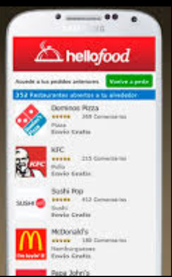

#ÃuApp#
- La aplicación es para realizar pedidos de comidas ya sea: pizzas, hamburguesas, etc.
-  Está pensada para casi todo el público.

##Funcionalidades##
- Opciones de Elegir las tiendas de comida.
- A la hora de realizar el pedido obligatoriamente el usuario tiene que enviar su geolocalización.
- Opción para elegir las comidas.

##Diseño de la Arquitectura##
La aplicación consiste en que un comerciante de comidas en este caso, se registre en la App y que cree su cardapio de comidas. Los clientes (en este caso sería el que pide el delivery), tiene como opciones elegir tiendas de comida como también va a tener opción de elegir la comida del cardapio.

##Diagrama de Clase##

##Diagrama de Iteraccion##

##Diagrama de Pantalla##

##Formulario de Busqueda##

##Herramientas##
- Lenguaje de Programación Java
- Matrial design
- Firebase

##Analisis de Persona##
La persona que necesite hacer pedido de comida o bebidas lo podrá hacer mediante esta aplicación, ya que la función será de ofrecer tiendas que hagan entrega vía delivery. La forma de pago seria con el entregador de dichos ítems a la hora de entregar, el cliente cuando haga el pedido la aplicación pedirá que envié su geolocalización, esa misma geolocalización será usada por el entregador para ubicar al cliente que realizo el pedido.