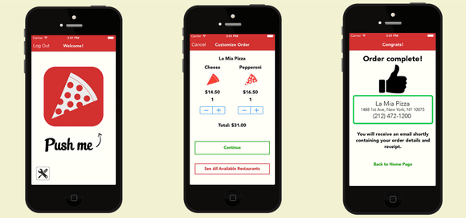

#ÃuApp
 La aplicacion es para realizar pedidos de comidas ya sea: pizzas,anburguezas,etc.
 Esta pensada para casi todo el publico.
 
 ##Funcionalidades
- Opciones de Elejir las tiendas de comida
- A la hora de realizar el pedido obligatoriamente el usuario tiene que enviar su geolocalizacion
- Opcion para elegir las comidas

##Diseño de la Arquitectura
La aplicacion conciste en que un comerciante de comidas en este caso, se registre en la App y que cree su cardapio de comidas. Los clientes (en este caso seria el que pide el delivery), tiene como opciones elegir tiendas de comida como tambien va a tener opcion de elegir la comida del cardapio..

##Diagrama de Clase

##Diagrama de Iteraccion

##Diagrama de Pantalla

##Formulario de Busqueda

##Herramientas
- Lenguaje de Programacion Java
- Matrial design
- Firebase